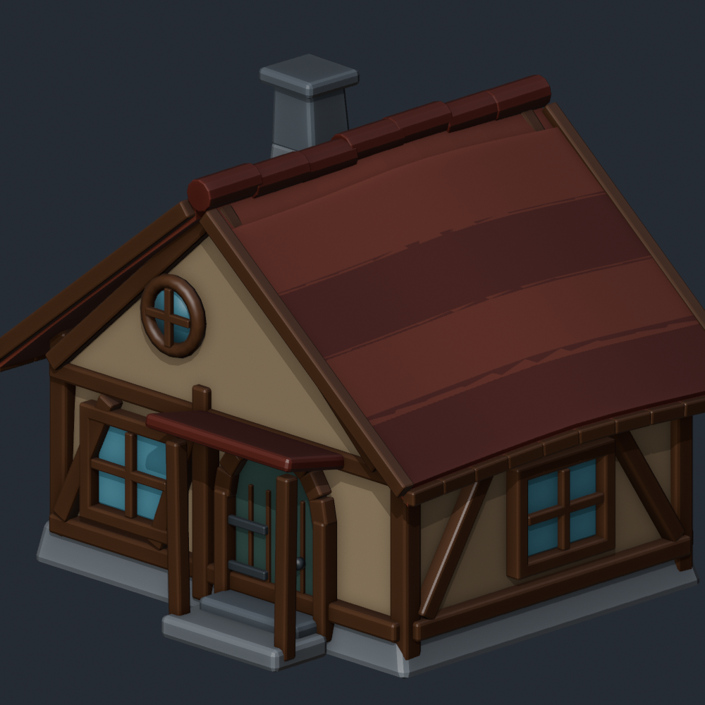
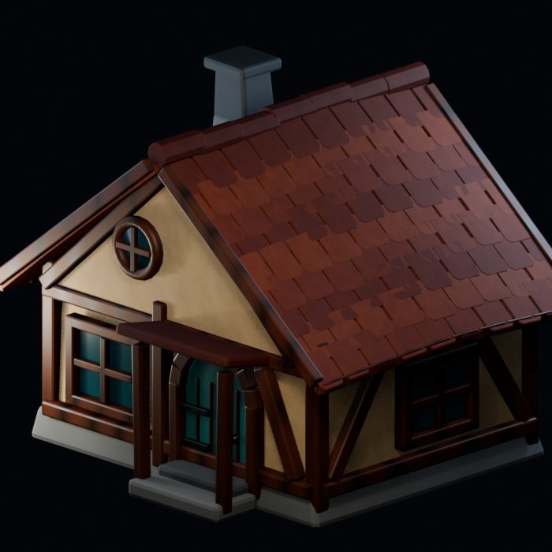
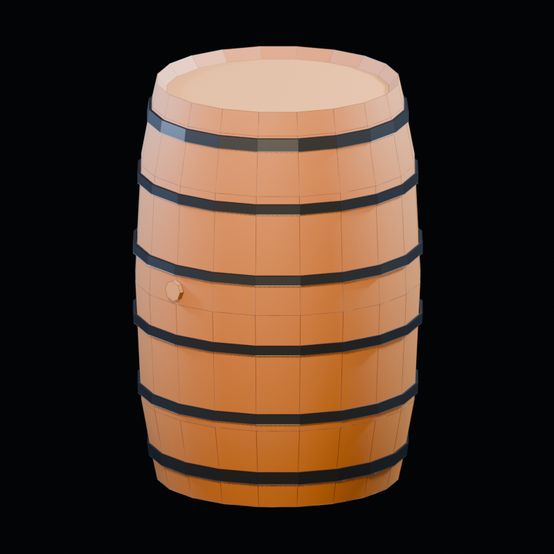
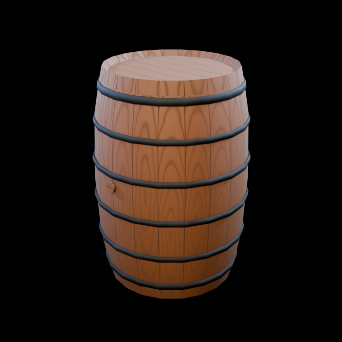
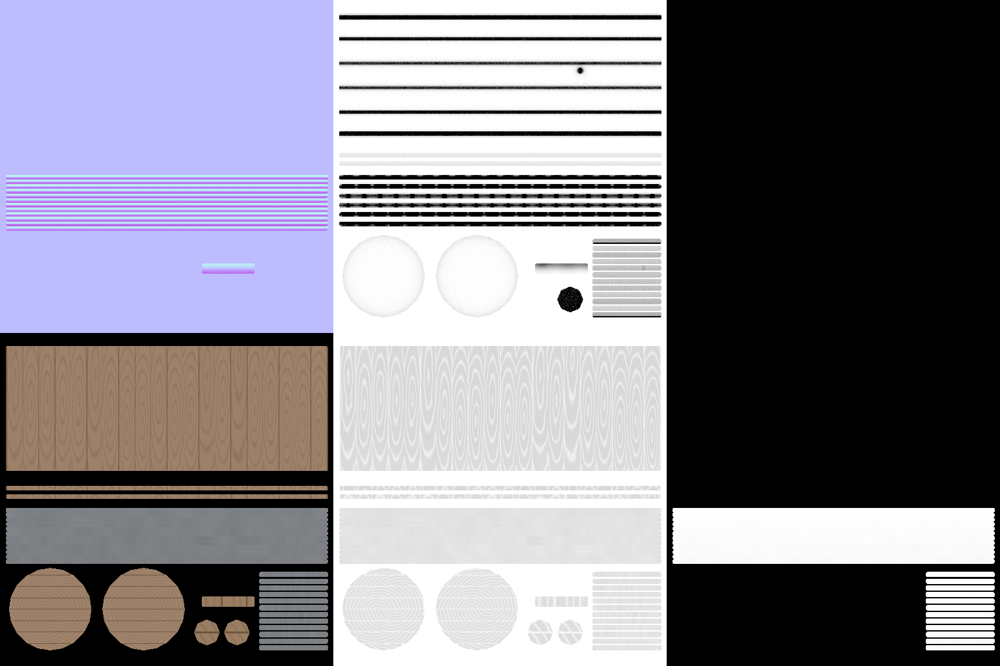
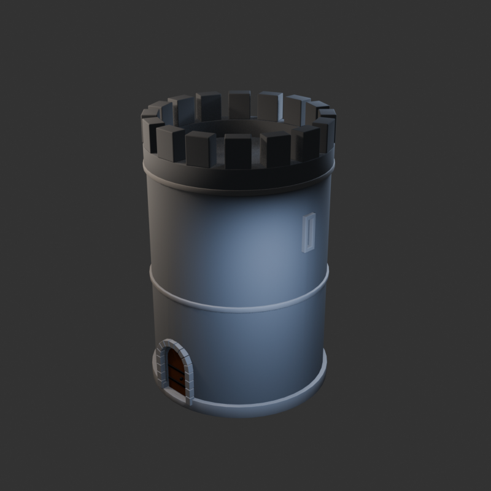
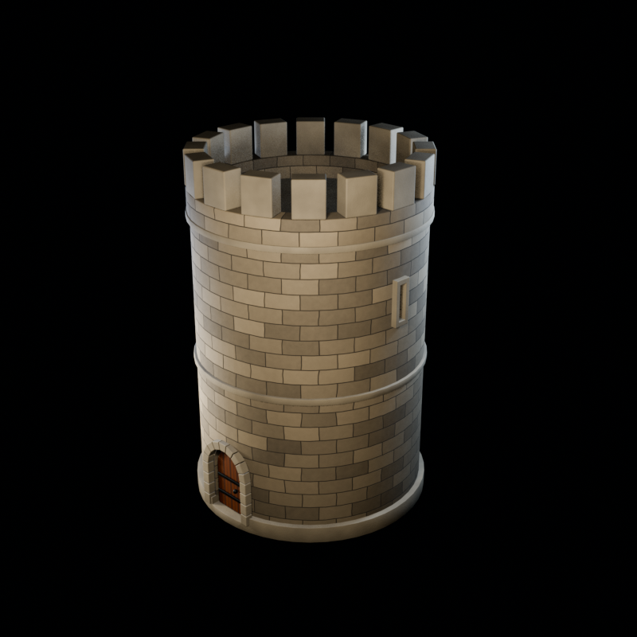
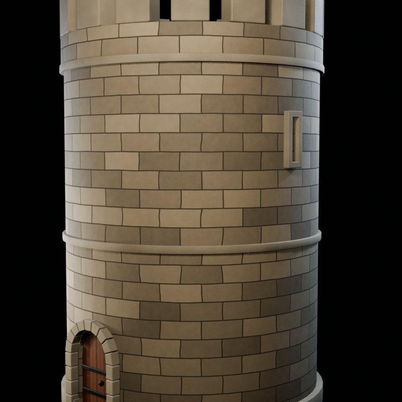

# Blender Skill Examples

These original fixtures demonstrate how the skills divide geometry, materials,
validation, and presentation. They are examples rather than golden assets.

## Fixture generators

The scripts write only to paths supplied on the command line. Run them from the
repository root with a Blender executable available as `$blenderPath`.

### Grounded low-poly barrel

```powershell
& $blenderPath --background --factory-startup --disable-autoexec `
  --python-exit-code 1 `
  --python samples/skills/blender/examples/scripts/create_grounded_lowpoly_barrel.py `
  -- --output-dir artifacts/barrel `
  --style-contract samples/skills/blender/examples/contracts/grounded-style-contract.json

& $blenderPath --background --factory-startup --disable-autoexec `
  --python-exit-code 1 `
  artifacts/barrel/stage-01-grounded-lowpoly-barrel-construction.blend `
  --python samples/skills/blender/examples/scripts/refine_grounded_lowpoly_barrel_construction.py `
  -- --output-dir artifacts/barrel `
  --source-manifest artifacts/barrel/operation-manifest-v1.json

& $blenderPath --background --factory-startup --disable-autoexec `
  --python-exit-code 1 `
  artifacts/barrel/stage-02-grounded-lowpoly-barrel-construction.blend `
  --python samples/skills/blender/examples/scripts/optimize_grounded_lowpoly_barrel.py `
  -- --output-dir artifacts/barrel `
  --source-manifest artifacts/barrel/operation-manifest-v2.json `
  --style-contract samples/skills/blender/examples/contracts/grounded-runtime-style-contract.json
```

The second contract records the human-approved runtime optimization decision
separately from the broader modeling contract. This keeps the staged source
traceable instead of silently changing its original budget.

### Clean-stylized cottage

```powershell
& $blenderPath --background --factory-startup --disable-autoexec `
  --python-exit-code 1 `
  --python samples/skills/blender/examples/scripts/create_stylized_cottage.py `
  -- --output artifacts/cottage/cottage.blend `
  --report artifacts/cottage/operation-report.json
```

### Grounded round tower

```powershell
& $blenderPath --background --factory-startup --disable-autoexec `
  --python-exit-code 1 `
  --python samples/skills/blender/examples/scripts/create_grounded_stone_tower.py `
  -- --output-dir artifacts/tower `
  --style-contract samples/skills/blender/examples/contracts/grounded-style-contract.json
```

The tower intentionally leaves ordinary masonry joints to materials. The
barrel demonstrates a continuous runtime shell instead of one mesh per stave.
The cottage demonstrates deliberate stylization and geometry-owned roof
overlap.

## Visual progression

### Cottage: modeled construction to procedural materials

| Model review | Material review |
|---|---|
|  |  |

### Barrel: optimized topology to baked material

| Wireframe review | Baked material | Bake channels |
|---|---|---|
|  |  |  |

### Tower: geometry/material boundary

| Model review | Procedural material review |
|---|---|
|  |  |



The screenshots are original outputs from the included workflow family. They
contain no third-party reference images, logos, private project names, or local
filesystem paths.
